# Full Application Flow — `Nodejs_mongoose-main` Project

## Snapshot Context

This is the **pre-authentication** state of the project (the same codebase the earlier session/cookie doc was written for, but *before* `express-session`, login, or logout exist). Confirmed by reading `app.js`, all controllers, all models, and `views/includes/navigation.ejs`:

- There is **no** `express-session`, no `auth.js` controller, no `/login` or `/logout` route, and no `isAuth` middleware.
- There is **no admin/normal-user distinction** at the code level. Every single request — regardless of path — is treated as the same hardcoded user.
- `/admin/*` routes have **zero access control**. Anyone can hit them.

So "how admin vs. normal user works" is answered honestly as: *it doesn't exist yet in this snapshot* — there's one fixed identity, and this document treats that as fact rather than assuming a role system that isn't in the code.

---

## 1 — App Bootstrap (`app.js`)

```mermaid
flowchart TD
    A[app.js starts] --> B[express app created\nview engine: ejs\nviews: 'views']
    B --> C[Require routes/admin, routes/shop, models/user]
    C --> D[bodyParser.urlencoded\nParses req.body]
    D --> E[express.static\nServes /public]
    E --> F["Hardcoded 'current user' middleware\nUser.findById('6a2fa43...') → req.user"]
    F --> G["app.use('/admin', adminRoutes)"]
    G --> H["app.use(shopRoutes)"]
    H --> I["app.use(errorController.get404)\n(catch-all, must be last)"]
    I --> J[mongoose.connect(Atlas URI)]
    J --> K{User.findOne finds\nan existing user?}
    K -- No --> L[Seed default user\nname: Max, email: max@test.com, cart: []]
    K -- Yes --> M[Skip seeding]
    L --> N[app.listen(3000)]
    M --> N
```

> [!IMPORTANT]
> `app.listen(3000)` is called **inside** the `mongoose.connect().then()` callback, not at the top level. The HTTP server does not start accepting connections until the MongoDB connection succeeds. If the connection fails, `.catch(error => console.log(error))` just logs it — the server never starts and the process doesn't exit or retry.

> [!NOTE]
> `util/database.js` (raw `mongodb` driver, `mongoConnect`/`getDb`) and `util/path.js` are **leftover/dead code** from an earlier version of this project. Nothing in the current codebase imports or calls them — `app.js` connects directly via `mongoose.connect(...)` and uses `path.join(__dirname, 'public')` inline instead.

---

## 2 — Middleware Execution Order (every request)

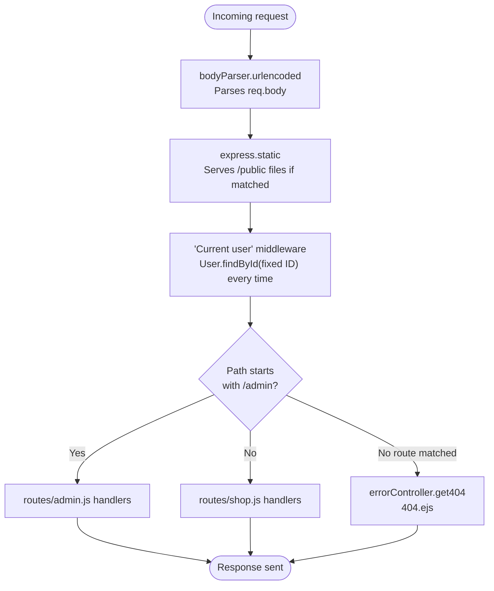

> [!WARNING]
> The "current user" middleware runs `User.findById(...)` **on literally every request**, including static asset requests that make it past `express.static`, and it never checks a cookie, header, or session — it always fetches the same document. This is the seam where real authentication (session-based, as in the earlier doc) would later replace this hardcoded lookup with `req.session.user` + a conditional `next()`.

---

## 3 — Shop: Browsing (Home, Product List, Product Detail)

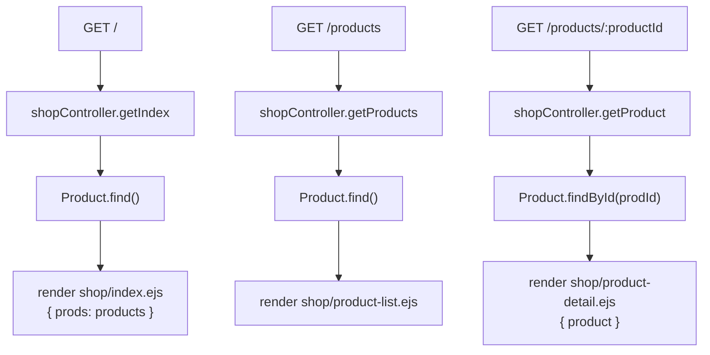

`Product.find()` and `Product.findById()` are plain Mongoose queries against the `products` collection — no population, no filtering by user, since the catalog is shared across all users.

---

## 4 — Shop: Viewing the Cart

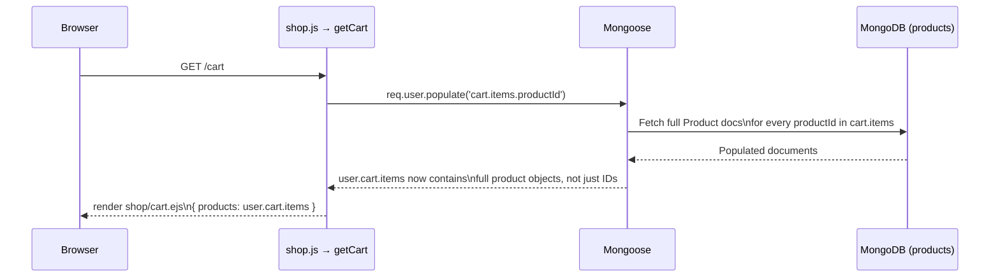

> [!NOTE]
> `cart.items` on the `User` schema is an embedded array of `{ productId: ObjectId (ref: 'Product'), quantity: Number }`. Calling `.populate('cart.items.productId')` is what turns each raw `productId` reference into the full `Product` document, in one call, without you writing a manual `Product.find({_id: {$in: [...]}})` yourself.

---

## 5 — Shop: Add to Cart (`POST /cart`)

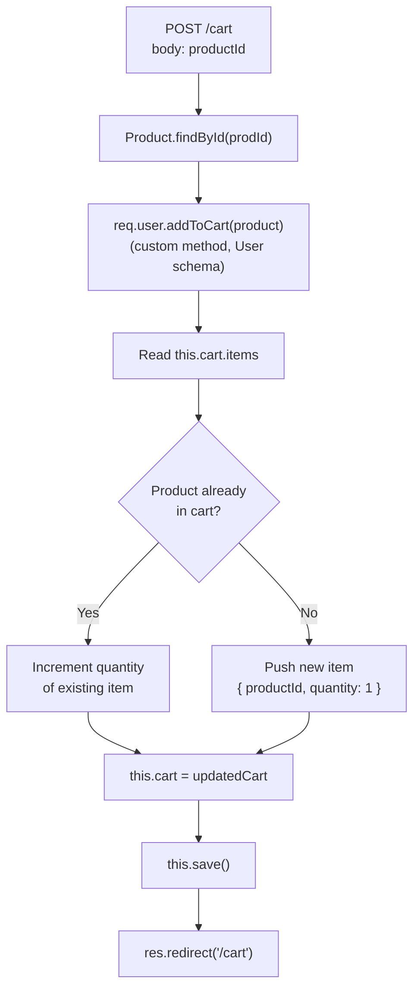

> [!WARNING]
> **Confirmed bug in `models/user.js`.** `addToCart` ends with `this.save()` — **not** `return this.save()`:
> ```js
> this.cart=updatedCart
> this.save()//built in save
> }
> ```
> Since nothing is returned, `req.user.addToCart(product)` resolves to `undefined` immediately, *before* the actual MongoDB write finishes. In `postCart`:
> ```js
> Product.findById(prodId).then(product=>{
>   return req.user.addToCart(product)
> }).then(result=>{
>   res.redirect("/cart")
> })
> ```
> the second `.then` — and therefore the redirect — fires without waiting for `this.save()` to complete. This is the exact same class of race condition the session doc's `session.save()` note warns about, just uninitentionally reintroduced here. Compare this with `removeFromCart` and `clearCart` below, which both correctly `return this.save()`.

---

## 6 — Shop: Remove from Cart (`POST /cart-delete-item`)

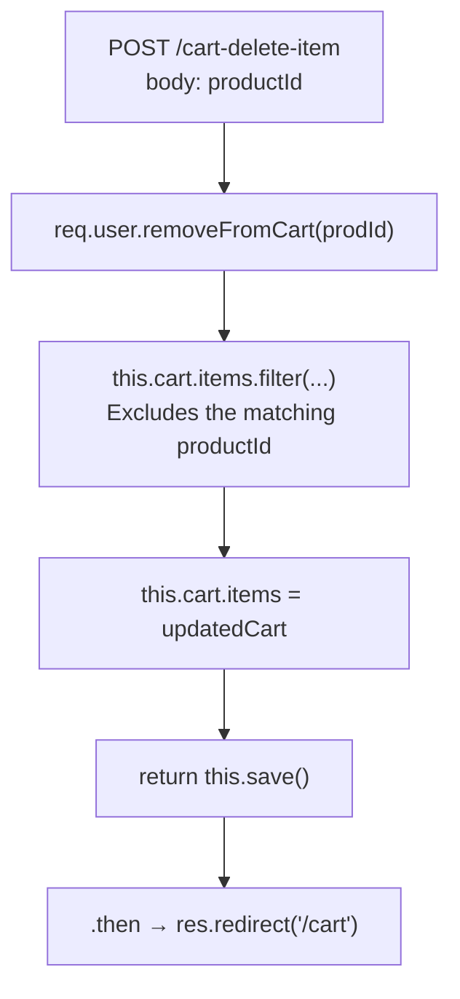

Unlike `addToCart`, `removeFromCart` correctly `return`s the save promise, so the redirect only happens after MongoDB confirms the write.

---

## 7 — Shop: Place an Order (`POST /create-order`)

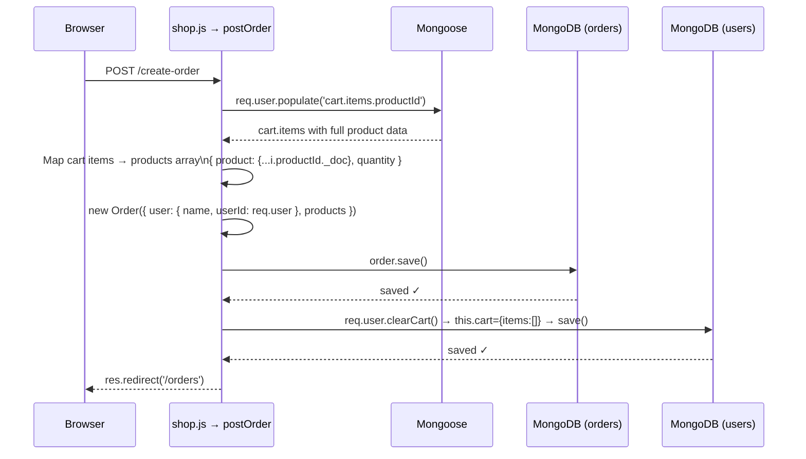

> [!NOTE]
> `userId: req.user` passes the **whole Mongoose document**, not `req.user._id`, into a field typed as `Schema.Types.ObjectId`. Mongoose is lenient here: when a document is assigned to an ObjectId-typed path, it automatically extracts `_id` and casts it. It works, but `req.user._id` would be the explicit, unambiguous way to write it.
>
> `{...i.productId._doc}` spreads Mongoose's internal `_doc` property to pull the plain data out of the populated `Product` document (rather than the full Mongoose document wrapper) before storing it as a plain-object snapshot inside the order — this is why an `Order`'s `products` field is typed as `Object`, not a `ref`. Orders keep a frozen copy of product data at purchase time, so later edits to a `Product` don't retroactively change past orders.

---

## 8 — Shop: View Orders (`GET /orders`)

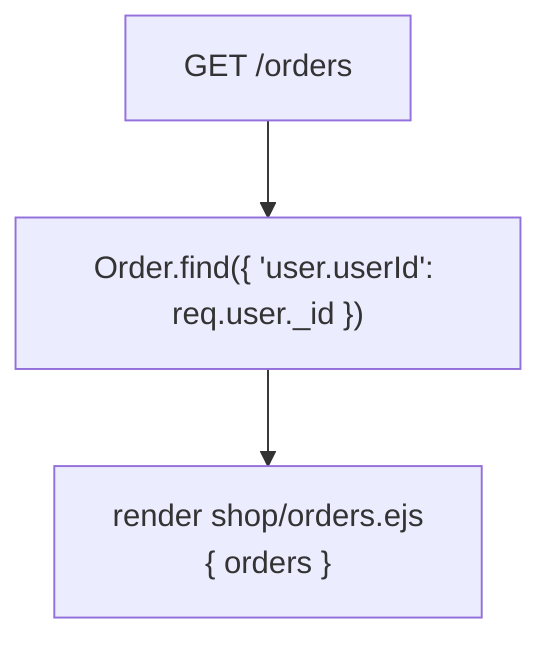

Queries the `orders` collection filtered by the embedded `user.userId` subfield — not a `populate()`, since `Order` documents already store a frozen snapshot of the user's name and the products, not references that need expanding.

---

## 9 — Admin: Add Product

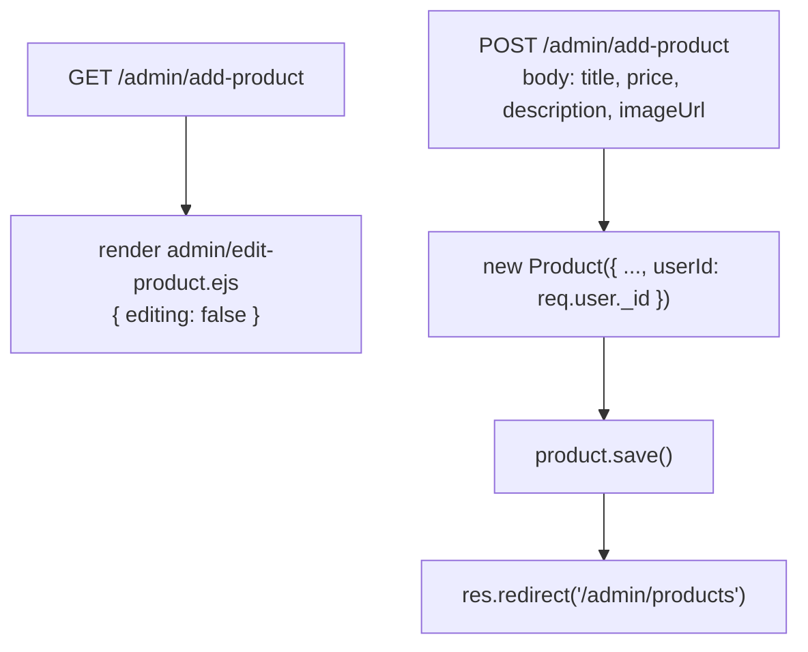

---

## 10 — Admin: List Products

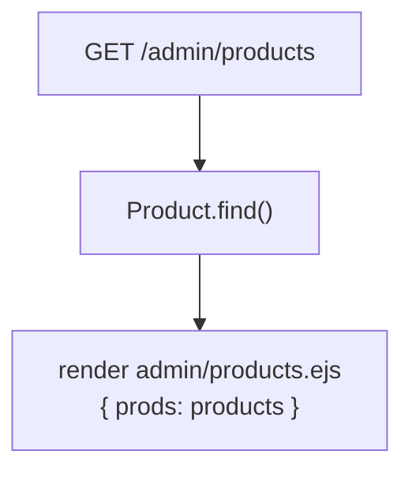

> [!NOTE]
> The controller has commented-out lines showing further Mongoose query options that aren't currently active: `.select('title price -_id')` (field projection — only return specific fields) and `.populate('userId', 'name')` (expand the `userId` reference into the owning user's `name` instead of leaving it as a raw ObjectId). Both are valid, just unused in this snapshot.

---

## 11 — Admin: Edit Product

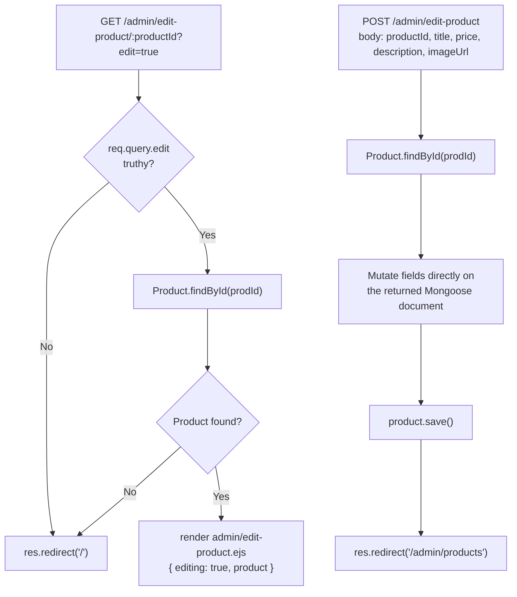

> [!WARNING]
> **Confirmed bug in `controllers/admin.js` → `postEditProduct`.** The price field is assigned to a typo'd property:
> ```js
> product.title=updatedTitle
> product.proce=updatedPrice   // should be product.price
> product.description=updatedDesc
> product.imageUrl=updatedImageUrl
> ```
> `proce` isn't a field in the `Product` schema, so Mongoose silently attaches it as a throwaway property that's never persisted as `price`. The confirmed effect: **editing a product's price through the admin form never actually updates it** — title, description, and imageUrl save correctly, price silently doesn't.

---

## 12 — Admin: Delete Product

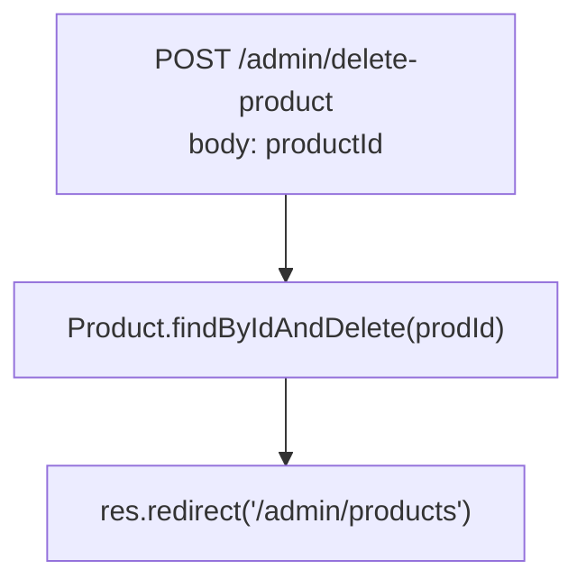

`findByIdAndDelete` is a single Mongoose built-in that finds and removes the document in one round trip — no separate find-then-delete needed.

---

## 13 — Data Model Relationships

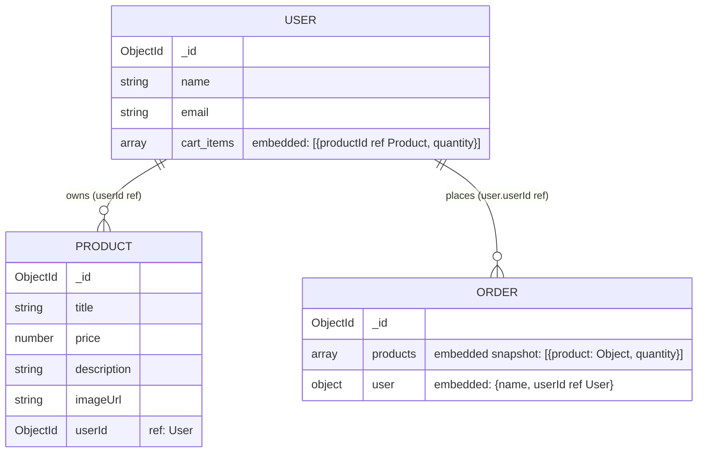

Two different relationship styles are in play:
- **Live references** (`ref: 'Product'`, `ref: 'User'`) — resolved on demand via `.populate()`. Used for `User.cart.items.productId` and `Product.userId`.
- **Frozen embedded snapshots** — plain `Object` fields with no `ref`, copied in at creation time and never re-synced. Used for `Order.products` and `Order.user`, which is why placing an order first `populate()`s the cart, then spreads the raw data (`._doc`) into a plain object before saving — deliberately decoupling the order's history from future edits to the live `Product`/`User` documents.

---

## 14 — Mongoose Methods Used, Reference Table

| Method | Type | Used in | Purpose |
|---|---|---|---|
| `mongoose.model(name, schema)` | Static | All 3 active models | Registers/compiles a schema into a usable model |
| `Model.find()` | Query | shop.js, admin.js | Fetch all documents in a collection |
| `Model.findById(id)` | Query | shop.js, admin.js, app.js | Fetch one document by `_id` |
| `Model.findByIdAndDelete(id)` | Query | admin.js | Find and remove in one operation |
| `Model.findOne()` | Query | app.js (seed check) | Fetch the first matching document |
| `new Model({...})` | Constructor | admin.js, shop.js | Build an in-memory document instance |
| `doc.save()` | Instance | Everywhere a document is created/mutated | Insert or update the document in MongoDB |
| `doc.populate(path)` | Instance | shop.js (`getCart`, `postOrder`) | Resolve `ref` fields into full documents |
| `doc._doc` | Instance property | shop.js (`postOrder`) | Access the plain-object data underneath a Mongoose document wrapper |
| `userSchema.methods.addToCart` | Custom instance method | shop.js (`postCart`) | Add/increment a cart line item, **missing `return`** |
| `userSchema.methods.removeFromCart` | Custom instance method | shop.js (`postCartDeleteProduct`) | Filter out a cart line item, correctly returns `save()` |
| `userSchema.methods.clearCart` | Custom instance method | shop.js (`postOrder`) | Reset `cart.items` to `[]`, correctly returns `save()` |
| `Schema.Types.ObjectId` + `ref` | Schema definition | product.js, user.js, order.js | Declares a field as a reference to another collection |

---

## 15 — Full Route Reference

| Method | Path | Controller function | Models touched | View rendered |
|---|---|---|---|---|
| GET | `/` | `shop.getIndex` | Product | `shop/index` |
| GET | `/products` | `shop.getProducts` | Product | `shop/product-list` |
| GET | `/products/:productId` | `shop.getProduct` | Product | `shop/product-detail` |
| GET | `/cart` | `shop.getCart` | User (populate Product) | `shop/cart` |
| POST | `/cart` | `shop.postCart` | Product, User | redirect `/cart` |
| POST | `/cart-delete-item` | `shop.postCartDeleteProduct` | User | redirect `/cart` |
| POST | `/create-order` | `shop.postOrder` | User, Order | redirect `/orders` |
| GET | `/orders` | `shop.getOrders` | Order | `shop/orders` |
| GET | `/admin/add-product` | `admin.getAddProduct` | — | `admin/edit-product` |
| POST | `/admin/add-product` | `admin.postAddProduct` | Product | redirect `/admin/products` |
| GET | `/admin/products` | `admin.getProducts` | Product | `admin/products` |
| GET | `/admin/edit-product/:productId` | `admin.getEditProduct` | Product | `admin/edit-product` |
| POST | `/admin/edit-product` | `admin.postEditProduct` | Product | redirect `/admin/products` |
| POST | `/admin/delete-product` | `admin.postDeleteProduct` | Product | redirect `/admin/products` |
| * | (unmatched) | `error.get404` | — | `404` |

`GET /checkout` exists as a controller function (`getCheckout`) but its route registration is commented out in `routes/shop.js`, so it's currently unreachable.

---

## 16 — Everything Found Worth Knowing (Summary)

> [!IMPORTANT]
> **Confirmed issues in this snapshot, in order of impact:**
> 1. No authentication at all — `req.user` is hardcoded to one seeded document; "admin" and "normal user" aren't distinct roles yet.
> 2. `/admin/*` has no access-control middleware protecting it.
> 3. `addToCart` doesn't return `this.save()` → redirect can race ahead of the actual write.
> 4. `postEditProduct` writes to `product.proce` instead of `product.price` → price edits silently never persist.
> 5. `util/database.js` and `util/path.js` are dead code, superseded by direct `mongoose.connect()` and inline `path.join()` calls in `app.js`.
> 6. `GET /checkout` is implemented but unreachable (route commented out).

None of these break the happy path for browsing, adding non-price edits, or placing orders — they're the kind of gaps that typically get closed exactly when a project moves from "raw Mongoose CRUD" into the session/auth layer covered in the earlier document.
